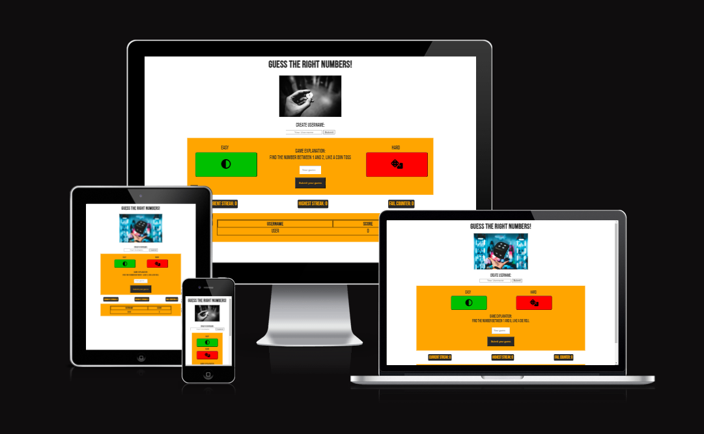
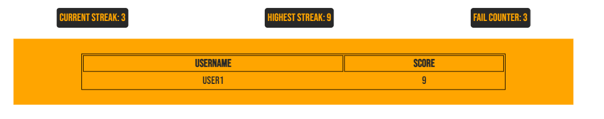

# Number Guesser

Welcome to my homepage [Number Guesser](https://mienjung97.github.io/Number_guesser_PP2/)

## Site Overview
Number Guesser is a simple game in which you can test your luck against the odds in two games: Game "Coin", which simbolizes a coin toss with the odds of 1 in 2 and game "Die", which has the odds of rolling a six sided die. You have to create a Username to start the game, which from this point on will keep track of your current streak, your "wrong inputs" and your highest streak. The latest will be saved in the leaderboard table - which is important, since you are able to crate as much Usernames as you want, each starting with all three scores of "0". 

# Contents

1. [**Site Overview**](<#site-overview>)
2. [**Planning stage**](<#planning-stage>)
   - [**_Idea_**](<#idea>)
   - [**_Site aims_**](<#site-aims>)
   - [**_Target Audience_**](<#target-audience>)
   - [**_Site Goals_**](<#site-goals>)
   - [**_Typography_**](<#typography>)
   - [**_Color scheme_**](<#color-scheme>)
3. [**Features**](<#features>)
   - [**_Navigation_**](<#navigation>)
   - [**_Create a Username_**](<#create-a-username>)
   - [**_Game one: Coin flip_**](<#game-one:-coin-flip>)
   - [**_Game two: Roll a die_**](<#game-two:-roll-a-die>)
   - [**_Scoreboard_**](<#scoreboard>)
4. [**Technologies Used**](<#technologies-used>)
5. [**Testing**](<#testing>)
   - [**Bugs**](<#bugs>)
   - [**Bugfixes**](<#bugfixes>)
   - [**Repository problems**](<#repository-problems>)
   - [**Validation**](<#validation>)
   - [**Responsiveness Test**](<#responsiveness-test>)
   - [**Lighthouse**](<#lighthouse>)
   - [**Browser Compatibility**](<#browser-compatibility>)
6. [**Deployment**](<#deployment>)
7. [**Credits**](<#credits>)
   - [**_Honorable mentions_**](<#honorable-mentions>)
   - [**_General reference_**](<#general-reference>)
   - [**_Content_**](<#content>)
   - [**_Media_**](<#media>)

# Planning stage
## Idea 
- The idea for this webpage was to create a number guessing game that shows how hard it is to get multiple right guesses in a row. First, I thought about creating a lotto game (odds: 1 in 49, 6 times to win), but there a highscore higher than 1 would have been unlikely.
## Site Aims 
- The website aims to show how hard it is, to guess multiple random outcomes in an easy and optainable way. 
## Target Audience 
- Anyone who is interested in testing their luck against the odds.
## Site Goals 
- The goal was to create two games, one game with the odds of one in two, symbolizing a coin toss, and one game with the odds of one in six, illustrating the odds of rolling a die.

[Back to top](<#contents>)

## Typography 
- I have used the same "Bebas Neue" display font from google fonts for the whole project.

[Back to top](<#contents>)

## Color scheme 
For the webpage I have used orange, white, grey and black colors since they provide a good contrast.   The following pictures show all individual colors I have used:
- Grey and Orange:  

- White:  

- Red and Green for Buttons:  

  
Created with [rgbacolorpicker](https://rgbacolorpicker.com/)

[Back to top](<#contents>)

# Features 

## Navigation 
- The Navigation of the webpage is vers straight forward: To display the game, the user gets an alert, telling him to input a username (after confirming the alert, the focus is set to the username input). After confirming their username via the submit button or the "enter" key, the game will be displayed.
- As default, the game "Coin" will be played. Again, after submitting the username, the focus is in the input field, which can be submitted via button or the "enter" key. 
- The user can then decide to switch between games by clicking the corresponding button (Label "easy", green button with coin symbol: "Coin" game; Label "hard", red button with dice symbol: "Die" game)
- By entereing a new username, the scores (besides the score board table) will be reset to "0" and a new entry in the scoreboard will be created.

[Back to top](<#contents>)

## Create a Username
- First an alert promt shows up informing the user to create a username:   

- Once the alert has been dismissed, the focus will go to the input field:  

- After a username has been set, the game "Coin" starts and becomes visible for the user.

[Back to top](<#contents>)

## Game one: Coin flip
- The first game represents the odds of a coin flip: 1 in 2.  

[Back to top](<#contents>)

## Game two: Roll a die 
- The second game represents the odds of rolling a die: 1 in 6.  

[Back to top](<#contents>)

## Scoreboard
- The scoreboard will show as many usernames as the user will put in.
- As soon as there are more than one user, a button "Delete last user" will appear and does what it describes.
- The following picture still has USER3 as an active player, so all scores are still shown.  
  
- As soon as USER4 will be entered, it will reset all score keeping items and add a new user:  
 

[Back to top](<#contents>)

# Technologies Used 
- [HTML5](https://html.spec.whatwg.org/) - provides the content and structure for the website.
- [CSS](https://www.w3.org/Style/CSS/Overview.en.html) - provides the styling.
- [JavaScript](https://www.javascript.com/) - provides the nessesary functions to create the games.
- [Gitpod](https://www.gitpod.io/#get-started) - used to host and edit the website.
- [Github](https://github.com/) - used to deploy the website.
- [Balsamiq](https://balsamiq.com/wireframes/) - used to create the wireframes.

[Back to top](<#contents>)

# Deployment

The website was deployed on GitHub Pages following these steps:

1. Go to GitHub, navigate through Repository/settings/pages.
2. Select "main branch" in the source tab and click save.
3. The page should look like this, which includes the webpages address:  

- Information on how to fork a project: [Fork the project](https://docs.github.com/en/pull-requests/collaborating-with-pull-requests/working-with-forks/fork-a-repo)

- Information on how to clone a project: [Clone the project](https://docs.github.com/en/repositories/creating-and-managing-repositories/cloning-a-repository) 

- Difference between clone and fork: "Forking creates your own copy of a repository in a remote location (for example, GitHub). Your own copy means that you will be able to contribute changes to your copy of the repository without affecting the original repository. Cloning makes a local copy of a repository, not your own copy." [Full explanation](https://www.educative.io/answers/what-is-the-difference-between-forking-and-cloning-in-git)

[Back to top](<#contents>)

# Testing
- The Website was continiously testet for responsiveness and functional JavaScript code with console.log() function. Therefore I was able to correct all the small mistakes. 
- First I used code multiple times (same code for each game), which worked but made the code not very readable. Through guidance by my mentor, I was able to delete all the dublicate code. 

[Back to top](<#contents>)

## Bugs
- In Mozilla Firefox, the borders of the buttons in the "game-area" will be displayed as a white color:  
 
- In the attempt of exchanging the alert() function with modals, I created a bug which only appears, if the user tries to submit the number guess via the keyboard: since the eventListener is waiting for a "keyup", the message only will be displayed as long as the "enter" key gets held down. This results in an alert for passing in nothing and submitting, if "enter" is held down too long. If the user decides to use the submit button, it works the way it should. 
- Similar bug on mobile version: if the user uses the phone keybord to submit, no message will be shown - if the user clicks the submitbutton, it works the way it should.
- (FIXED) Bceause the scoreboard will be created with JavaScript and the "score" cell will get assigned an id with use of the username, creating the same username multiple times is possible, but leads to problems: The cell id is bound by the username and creating a new username will reset the "highest score" which is used to build the score board - so if a username gets entered twice, it will reset the previous score for the username as well.
- (FIXED) When creating the same useranme multiple times, only the score of the first entry in the scoreboard will be increased.

[Back to top](<#contents>)

## Bugfixes
- Bugfixes: the dublicate id was resolved by checking if the username exists. This was possible via restructuring my functions for the scoreboard with the help of my mentor. Now saving the table in the local storage, and dublicate usernames are not a problem anymore.

[Back to top](<#contents>)

## Repository problems

After trying to code very similar to the "Love Maths" project, I ran into more errors and bugs with each line of code. About halfway through, I decided to clear the js file, use the code that worked and build the following code by myself and the help of others [See Credits](<#credits>).

[Back to top](<#contents>)

## Validation 

### HTML validation via [HTML-validator](https://validator.w3.org/nu/)
- index.html:  

### CSS validation via [CSS-validator](https://jigsaw.w3.org/css-validator/validator)
- style.css:  

### JS Validation via [jshint](https://jshint.com/)
- script.js: 55 warnings were showed, none of them important.  

[Back to top](<#contents>)

## Responsiveness Test

- The responsive design tests were carried out manually with [Google Chrome DevTools](https://developer.chrome.com/docs/devtools/) and [Responsive Design Checker](https://www.responsivedesignchecker.com/).

|        | Galaxy Fold | Pixel 7   | iPhone 14 Pro Max | iPad Air | iPad Pro | Display <1200px | Display >1200px |
|--------|-------------|-----------|-------------------|----------|----------|-----------------|-----------------|
| Render |     pass    |   pass    |       pass        |   pass   |   pass   |      pass       |      pass       |
| Images |     pass    |   pass    |       pass        |   pass   |   pass   |      pass       |      pass       |
| Links  |     pass    |   pass    |       pass        |   pass   |   pass   |      pass       |      pass       |

[Back to top](<#contents>)

## Lighthouse 

- The website was tested with lighthouse for both mobile and dektop screens. These are the results:
- Mobile:  

- Desktop:  

 
- Note: since the game starts with an almost empty screen, I disabled the "hide" class (which shows/hides the wholepage) in the div with id="begin" for testing with lighthouse to get a more accurate reading.

[Back to top](<#contents>)

## Browser Compatibility

Owning Cats website was tested on the following browsers with no visible issues for the user: 
- Google Chrome
- Microsoft Edge
- Mozilla Firefox 

Appearance, functionality and responsiveness were consistent throughout for a range of device sizes and browsers.

[Back to top](<#contents>)

# Credits

## Honorable mentions 
I have to thank my dear partner for being so patient since there is not a lot of free time and yet she fully supports me on a daily basis.  
I am also thankful for my co-student Marceillo and Jan, who I worked closly together and helped me in times of questioning.  
A big thank you goes out to the Tutors who have helped me along my second protfolio project: especially Sarah, Sean and Thomas helped me understand some problems, helped with technical problems and guided me towards a correct code. This includes but is not limited to setting the IDs in the table and understanding the modals.

[Back to top](<#contents>)

## General reference: 
- The biggest help and inspiration in my first project was my Mentor Akshat Garg who helped me a lot with understanding how to evade dublicate code.
- For incrementing the scores, I took great inspiration from the [Love Maths](https://github.com/Mienjung97/love-maths) project.
- For creating this readme, I have used the template from my [Owning Cats](https://github.com/Mienjung97/Owning-Cats) project, which I took inspiration from [Ewan Colquhoun](https://github.com/EwanColquhoun/wawaswoods/blob/master/README.md?plain=1#deployment) and my colleague [Marceillo](https://github.com/Marceillo) for the general overview.
- I used some help from various [YouTube](https://www.youtube.com/results?search_query=make+a+scorebord+with+username+in+javascript) tutorials, [stackoverflow](https://stackoverflow.com/) posts and [w3schools](https://www.w3schools.com/) tutorials.
- For understanding some problems, I also used [ChatGPT](https://chat.openai.com/) to get the explainations I nedded.

[Back to top](<#contents>)

## Content

- Font came from [Google Fonts](https://fonts.google.com/).
- Icons came from [Font Awesome](https://fontawesome.com/).
- Colors were created with [rgbacolorpicker](https://rgbacolorpicker.com/).
- For rezizing the images, the tool [Images Resizer](https://imageresizer.com/) was used.
- The responsive image was created with [Amiresponsive](https://ui.dev/amiresponsive).

[Back to top](<#contents>)

## Media

- The two pictures were taken from [Unsplash](https://unsplash.com/), the actual links are included as comments in the code.

[Back to top](<#contents>)